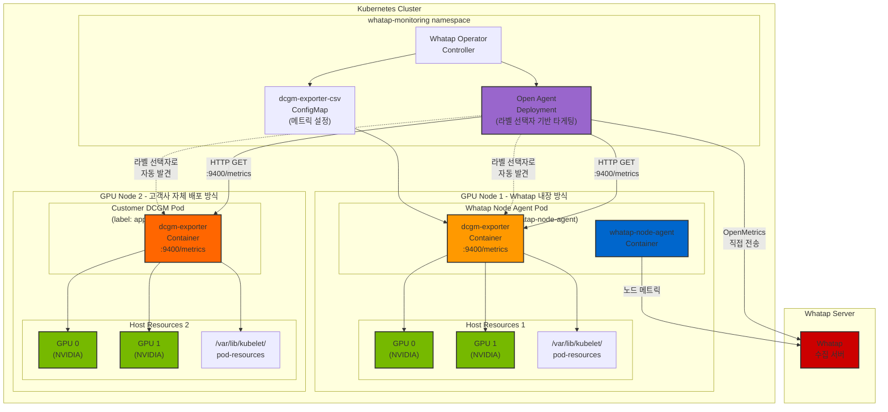
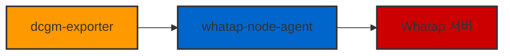

# Whatap GPU 모니터링 가이드

## 개요

Whatap Operator는 Kubernetes 클러스터에서 NVIDIA GPU 리소스를 모니터링할 수 있는 기능을 제공합니다. GPU 모니터링은 NVIDIA DCGM (Data Center GPU Manager) Exporter를 활용하여 GPU 성능 메트릭을 수집하고 Whatap 서버로 전송합니다.

## GPU 모니터링 아키텍처

### 🏗️ GPU 모니터링 통합 구조도



### 🔄 Legacy vs 새로운 방식 비교

#### **Legacy 방식 (이전)**


#### **새로운 방식 (현재)**
```mermaid
graph LR
    DCGM["dcgm-exporter<br/>:9400/metrics"] --> OA["Open Agent<br/>(스크래핑)"]
    OA --> COLLECTOR["Whatap 서버<br/>(OpenMetrics)"]
    WNA["whatap-node-agent"] --> COLLECTOR

    style DCGM fill:#ff9900,stroke:#333,stroke-width:2px
    style OA fill:#9966cc,stroke:#333,stroke-width:2px
    style WNA fill:#0066cc,stroke:#333,stroke-width:2px
    style COLLECTOR fill:#cc0000,stroke:#333,stroke-width:2px
```</SEARCH>

### 🔧 주요 구성 요소

| 구성 요소 | 역할 | 설명 |
|-----------|------|------|
| **DCGM Exporter (내장)** | GPU 메트릭 수집 | Whatap Node Agent Pod 내 내장된 DCGM Exporter, :9400/metrics 엔드포인트 제공 |
| **DCGM Exporter (고객사)** | GPU 메트릭 수집 | 고객사에서 자체 배포한 DCGM Exporter, 특정 라벨로 식별 |
| **Open Agent** | 메트릭 스크래핑 | 라벨 선택자를 통해 DCGM Exporter를 자동 발견하고 스크래핑 |
| **Whatap Node Agent** | 노드 모니터링 | 노드 레벨 메트릭 수집 및 전송 |
| **ConfigMap** | 메트릭 설정 | 수집할 GPU 메트릭 정의 (whatap-dcgm-exporter.csv) |
| **Pod Resources** | 리소스 정보 | Kubelet의 GPU 할당 정보 |

### 🎯 배포 방식별 특징

| 배포 방식 | 장점 | 사용 시나리오 |
|-----------|------|---------------|
| **Whatap 내장 방식** | 자동 구성, 간편한 설정 | 새로운 클러스터, 표준 GPU 모니터링 |
| **고객사 자체 배포** | 기존 인프라 활용, 커스텀 설정 | 기존 DCGM 배포 환경, 특수 요구사항 |

### 🎯 새로운 방식의 장점

| 장점 | 설명 | 기술적 이점 |
|------|------|-------------|
| **프로메테우스 호환성** | OpenMetrics 표준 지원 | 프로메테우스 쿼리로 GPU 메트릭 조회 가능 |
| **직접 전송** | Open Agent가 수집서버로 직접 전송 | 데이터 경로 단순화, 지연시간 감소 |
| **표준화된 메트릭** | OpenMetrics 형식 사용 | 다른 모니터링 도구와의 호환성 향상 |
| **확장성** | 독립적인 스크래핑 구조 | GPU 노드 확장 시 유연한 대응 |</SEARCH>

## GPU 모니터링 활성화

### 📋 기본 설정 (새로운 방식)

```yaml
apiVersion: monitoring.whatap.com/v2alpha1
kind: WhatapAgent
metadata:
  name: whatap
spec:
  features:
    # Open Agent 설정 - GPU 메트릭 스크래핑 담당
    openAgent:
      enabled: true
      globalInterval: "15s"
      globalPath: "/metrics"
      targets:
        - targetName: "dcgm-exporter"
          type: "PodMonitor"
          enabled: true
          namespaceSelector:
            matchNames:
              - "whatap-monitoring"
          selector:
            matchLabels:
              name: "whatap-node-agent"
          endpoints:
            - port: "9400"
              path: "/metrics"
              interval: "15s"
              scheme: "http"

    # K8s Agent 설정 - GPU 모니터링 활성화
    k8sAgent:
      masterAgent:
        enabled: true
      nodeAgent:
        enabled: true
      gpuMonitoring:
        enabled: true  # 🔑 DCGM Exporter 컨테이너 추가
```

### 📋 간단한 설정 (자동 구성)

```yaml
apiVersion: monitoring.whatap.com/v2alpha1
kind: WhatapAgent
metadata:
  name: whatap
spec:
  features:
    openAgent:
      enabled: true  # Open Agent 활성화
    k8sAgent:
      masterAgent:
        enabled: true
      nodeAgent:
        enabled: true
      gpuMonitoring:
        enabled: true  # GPU 모니터링 활성화
```
> **참고**: 간단한 설정 시 Open Agent가 자동으로 DCGM Exporter를 발견하고 스크래핑합니다.</SEARCH>

### 📋 고객사 자체 배포 DCGM Exporter 타게팅

고객사에서 이미 DCGM Exporter를 배포한 경우, 라벨 선택자를 통해 해당 Pod를 타게팅할 수 있습니다:

```yaml
apiVersion: monitoring.whatap.com/v2alpha1
kind: WhatapAgent
metadata:
  name: whatap
spec:
  features:
    # Open Agent 설정 - 고객사 DCGM Exporter 타게팅
    openAgent:
      enabled: true
      globalInterval: "15s"
      globalPath: "/metrics"
      targets:
        # Whatap 내장 DCGM Exporter (기본)
        - targetName: "whatap-dcgm-exporter"
          type: "PodMonitor"
          enabled: true
          namespaceSelector:
            matchNames:
              - "whatap-monitoring"
          selector:
            matchLabels:
              name: "whatap-node-agent"
          endpoints:
            - port: "9400"
              path: "/metrics"
              interval: "15s"
              scheme: "http"

        # 고객사 자체 배포 DCGM Exporter
        - targetName: "customer-dcgm-exporter"
          type: "PodMonitor"
          enabled: true
          namespaceSelector:
            matchNames:
              - "gpu-monitoring"  # 고객사 DCGM 네임스페이스
              - "default"
          selector:
            matchLabels:
              app: "custom-dcgm"  # 🔑 고객사 DCGM Pod 라벨
              component: "gpu-exporter"
          endpoints:
            - port: "9400"
              path: "/metrics"
              interval: "15s"
              scheme: "http"

    # K8s Agent 설정 - 내장 GPU 모니터링 비활성화 (선택사항)
    k8sAgent:
      masterAgent:
        enabled: true
      nodeAgent:
        enabled: true
      gpuMonitoring:
        enabled: false  # 고객사 DCGM만 사용하는 경우
```

### 🎯 라벨 선택자 설정 가이드

고객사 DCGM Exporter Pod에 다음과 같은 라벨이 설정되어 있어야 합니다:

```yaml
# 고객사 DCGM Exporter Pod 예시
apiVersion: v1
kind: Pod
metadata:
  name: custom-dcgm-exporter
  namespace: gpu-monitoring
  labels:
    app: "custom-dcgm"           # Open Agent 타게팅용 라벨
    component: "gpu-exporter"    # 추가 식별 라벨
spec:
  containers:
  - name: dcgm-exporter
    image: nvcr.io/nvidia/k8s/dcgm-exporter:4.2.3-4.1.3-ubuntu22.04
    ports:
    - name: metrics
      containerPort: 9400
    # ... 기타 설정
```

### 💡 하이브리드 모니터링

두 방식을 동시에 사용하여 하이브리드 GPU 모니터링도 가능합니다:

- **Whatap 내장 방식**: 새로운 GPU 노드
- **고객사 자체 배포**: 기존 GPU 노드

이 경우 Open Agent가 두 종류의 DCGM Exporter를 모두 자동으로 발견하고 스크래핑합니다.

### 🎯 GPU 노드 톨러레이션 설정

GPU 노드에 특별한 테인트가 있는 경우 톨러레이션을 추가해야 합니다:

```yaml
apiVersion: monitoring.whatap.com/v2alpha1
kind: WhatapAgent
metadata:
  name: whatap
spec:
  features:
    k8sAgent:
      nodeAgent:
        enabled: true
        tolerations:
          - key: "nvidia.com/gpu"
            operator: "Exists"
            effect: "NoSchedule"
          - key: "gpu"
            operator: "Exists"
            effect: "NoSchedule"
      gpuMonitoring:
        enabled: true
```

## 수집되는 GPU 메트릭

### 📊 상세 메트릭 카테고리

Whatap GPU 모니터링은 **40여 가지의 상세한 GPU 메트릭**을 실시간으로 수집합니다.

#### **1. 🔧 하드웨어 정보 (Static Configuration)**
| 메트릭 | 타입 | 설명 | 코드 |
|--------|------|------|------|
| `DCGM_FI_DRIVER_VERSION` | label | NVIDIA 드라이버 버전 | 1 |
| `DCGM_FI_NVML_VERSION` | label | NVML 라이브러리 버전 | 2 |
| `DCGM_FI_DEV_NAME` | label | GPU 디바이스 이름 | 50 |
| `DCGM_FI_DEV_SERIAL` | label | GPU 시리얼 번호 | 53 |
| `DCGM_FI_DEV_UUID` | label | GPU 고유 식별자 | 54 |
| `DCGM_FI_DEV_COMPUTE_MODE` | label | GPU 컴퓨트 모드 | 65 |
| `DCGM_FI_DEV_PERSISTENCE_MODE` | label | 지속성 모드 상태 | 66 |
| `DCGM_FI_DEV_VIRTUAL_MODE` | label | 가상화 모드 상태 | 500 |

#### **2. 🎯 MIG (Multi-Instance GPU) 정보**
| 메트릭 | 타입 | 설명 | 코드 |
|--------|------|------|------|
| `DCGM_FI_DEV_MIG_MODE` | label | MIG 모드 활성화 상태 | 67 |
| `DCGM_FI_DEV_MIG_MAX_SLICES` | label | 최대 MIG 슬라이스 수 | 69 |
| `DCGM_FI_DEV_MIG_GI_INFO` | label | MIG Graphics Instance 정보 | 76 |
| `DCGM_FI_DEV_MIG_CI_INFO` | label | MIG Compute Instance 정보 | 77 |

#### **3. ⚡ 클럭 주파수 (Clocks)**
| 메트릭 | 타입 | 설명 | 코드 |
|--------|------|------|------|
| `DCGM_FI_DEV_SM_CLOCK` | gauge | SM 클럭 주파수 (MHz) | 100 |
| `DCGM_FI_DEV_MEM_CLOCK` | gauge | 메모리 클럭 주파수 (MHz) | 101 |

#### **4. 🔋 전력 관리 (Power)**
| 메트릭 | 타입 | 설명 | 코드 |
|--------|------|------|------|
| `DCGM_FI_DEV_POWER_USAGE` | gauge | 현재 전력 사용량 (W) | 155 |
| `DCGM_FI_DEV_PSTATE` | gauge | GPU 전력 상태 (P-State) | 190 |

#### **5. 🌡️ 온도 (Temperature)**
| 메트릭 | 타입 | 설명 | 코드 |
|--------|------|------|------|
| `DCGM_FI_DEV_GPU_TEMP` | gauge | GPU 온도 (°C) | 150 |

#### **6. 📊 활용률 (Utilization)**
| 메트릭 | 타입 | 설명 | 코드 |
|--------|------|------|------|
| `DCGM_FI_DEV_GPU_UTIL` | gauge | GPU 전체 활용률 (%) | 203 |

#### **7. 🌐 PCIe 트래픽 (PCIe Traffic)**
| 메트릭 | 타입 | 설명 | 코드 |
|--------|------|------|------|
| `DCGM_FI_PROF_PCIE_TX_BYTES` | counter | PCIe 송신 바이트 총량 | 1009 |
| `DCGM_FI_PROF_PCIE_RX_BYTES` | counter | PCIe 수신 바이트 총량 | 1010 |

#### **8. 💾 프레임버퍼 메모리 (Framebuffer Memory)**
| 메트릭 | 타입 | 설명 | 코드 |
|--------|------|------|------|
| `DCGM_FI_DEV_FB_TOTAL` | gauge | 총 프레임버퍼 메모리 (MiB) | 250 |
| `DCGM_FI_DEV_FB_FREE` | gauge | 사용 가능한 메모리 (MiB) | 251 |
| `DCGM_FI_DEV_FB_USED` | gauge | 사용 중인 메모리 (MiB) | 252 |
| `DCGM_FI_DEV_FB_RESERVED` | gauge | 예약된 메모리 (MiB) | 253 |
| `DCGM_FI_DEV_FB_USED_PERCENT` | gauge | 메모리 사용률 (%) | 254 |

#### **9. 🛡️ ECC (Error Correcting Code)**
| 메트릭 | 타입 | 설명 | 코드 |
|--------|------|------|------|
| `DCGM_FI_DEV_ECC_SBE_AGG_TOTAL` | counter | 단일 비트 ECC 오류 누적 총계 | 312 |
| `DCGM_FI_DEV_ECC_DBE_AGG_TOTAL` | counter | 이중 비트 ECC 오류 누적 총계 | 313 |

#### **10. 🚀 고급 성능 메트릭 (Advanced Performance)**
| 메트릭 | 타입 | 설명 | 코드 |
|--------|------|------|------|
| `DCGM_FI_PROF_GR_ENGINE_ACTIVE` | gauge | 그래픽 엔진 활성 시간 비율 | 1001 |
| `DCGM_FI_PROF_SM_ACTIVE` | gauge | SM 활성 사이클 비율 | 1002 |
| `DCGM_FI_PROF_SM_OCCUPANCY` | gauge | SM 점유율 (상주 워프/SM) | 1003 |
| `DCGM_FI_PROF_PIPE_TENSOR_ACTIVE` | gauge | 텐서 파이프 활성 비율 | 1004 |
| `DCGM_FI_PROF_DRAM_ACTIVE` | gauge | 메모리 인터페이스 활성 비율 | 1005 |

### 🎯 메트릭 활용 가이드

#### **핵심 모니터링 메트릭**
- **GPU 활용률**: `DCGM_FI_DEV_GPU_UTIL` - GPU 전체 사용률
- **메모리 사용률**: `DCGM_FI_DEV_FB_USED_PERCENT` - GPU 메모리 사용률
- **온도**: `DCGM_FI_DEV_GPU_TEMP` - 열 관리 모니터링
- **전력**: `DCGM_FI_DEV_POWER_USAGE` - 전력 소비 추적

#### **성능 최적화 메트릭**
- **SM 점유율**: `DCGM_FI_PROF_SM_OCCUPANCY` - 워크로드 효율성
- **텐서 활성도**: `DCGM_FI_PROF_PIPE_TENSOR_ACTIVE` - AI/ML 워크로드 최적화
- **메모리 활성도**: `DCGM_FI_PROF_DRAM_ACTIVE` - 메모리 대역폭 활용도

#### **안정성 모니터링 메트릭**
- **ECC 오류**: `DCGM_FI_DEV_ECC_*` - 하드웨어 안정성
- **PCIe 트래픽**: `DCGM_FI_PROF_PCIE_*` - 데이터 전송 모니터링

## 동작 원리

### 🔄 GPU 모니터링 프로세스 (새로운 방식)

```mermaid
sequenceDiagram
    participant User as 👤 관리자
    participant Operator as 🔧 Whatap Operator
    participant OpenAgent as 🟣 Open Agent
    participant NodeAgent as 🐳 Node Agent Pod
    participant DCGM as 📊 DCGM Exporter
    participant GPU as 🎮 NVIDIA GPU
    participant Whatap as ☁️ Whatap Server

    Note over User, Whatap: 1️⃣ 설정 단계
    User->>Operator: WhatapAgent CR 생성<br/>(gpuMonitoring.enabled: true)
    Operator->>Operator: ConfigMap 생성<br/>(GPU 메트릭 설정)
    Operator->>OpenAgent: Open Agent Deployment 생성

    Note over User, Whatap: 2️⃣ 배포 단계
    Operator->>NodeAgent: Node Agent DaemonSet 생성
    NodeAgent->>DCGM: DCGM Exporter 컨테이너 추가
    DCGM->>GPU: GPU 리소스 접근 설정
    DCGM->>DCGM: :9400/metrics 엔드포인트 활성화

    Note over User, Whatap: 3️⃣ 모니터링 시작 (새로운 방식)
    DCGM->>GPU: GPU 메트릭 수집 (15초 간격)
    DCGM->>DCGM: OpenMetrics 형식으로 노출
    OpenAgent->>DCGM: HTTP GET :9400/metrics<br/>(스크래핑)
    OpenAgent->>Whatap: OpenMetrics 직접 전송
    NodeAgent->>Whatap: 노드 메트릭 전송
    Whatap->>Whatap: GPU 성능 분석 및 시각화<br/>(프로메테우스 쿼리 지원)
```</SEARCH>

### 🎯 라벨 선택자 기반 타게팅 프로세스

Open Agent는 라벨 선택자를 통해 다양한 DCGM Exporter를 자동으로 발견하고 스크래핑합니다:

```mermaid
sequenceDiagram
    participant OA as 🟣 Open Agent
    participant K8sAPI as 🎯 Kubernetes API
    participant DCGM_Builtin as 📊 DCGM (내장)
    participant DCGM_Custom as 📊 DCGM (고객사)
    participant Whatap as ☁️ Whatap Server

    Note over OA, Whatap: 🔍 자동 발견 프로세스
    OA->>K8sAPI: Pod 목록 조회<br/>(라벨 선택자 기반)
    K8sAPI-->>OA: 매칭되는 Pod 목록 반환

    Note over OA, Whatap: 📊 내장 DCGM 처리
    OA->>DCGM_Builtin: 라벨 확인<br/>(name=whatap-node-agent)
    DCGM_Builtin-->>OA: 매칭 확인
    OA->>DCGM_Builtin: HTTP GET :9400/metrics
    DCGM_Builtin-->>OA: GPU 메트릭 반환

    Note over OA, Whatap: 📊 고객사 DCGM 처리
    OA->>DCGM_Custom: 라벨 확인<br/>(app=custom-dcgm)
    DCGM_Custom-->>OA: 매칭 확인
    OA->>DCGM_Custom: HTTP GET :9400/metrics
    DCGM_Custom-->>OA: GPU 메트릭 반환

    Note over OA, Whatap: 📤 통합 전송
    OA->>Whatap: 모든 GPU 메트릭<br/>통합 전송
    Whatap->>Whatap: 노드별 GPU 성능<br/>분석 및 시각화
```</SEARCH>

### 🔧 라벨 선택자 매칭 로직

Open Agent의 타게팅 로직:

1. **네임스페이스 필터링**: `namespaceSelector`로 대상 네임스페이스 선별
2. **라벨 매칭**: `selector.matchLabels`로 Pod 식별
3. **엔드포인트 검증**: `:9400/metrics` 엔드포인트 접근 가능 여부 확인
4. **메트릭 수집**: OpenMetrics 형식으로 GPU 메트릭 스크래핑

```yaml
# 타게팅 설정 예시
targets:
  - targetName: "customer-dcgm"
    namespaceSelector:
      matchNames: ["gpu-monitoring"]  # 1️⃣ 네임스페이스 필터
    selector:
      matchLabels:
        app: "custom-dcgm"            # 2️⃣ 라벨 매칭
        component: "gpu-exporter"
    endpoints:
      - port: "9400"                  # 3️⃣ 엔드포인트 설정
        path: "/metrics"
```</SEARCH>

### 🛠️ 기술적 구현 세부사항

#### **DCGM Exporter 설정**
```yaml
# 자동으로 추가되는 DCGM Exporter 컨테이너
containers:
- name: dcgm-exporter
  image: nvcr.io/nvidia/k8s/dcgm-exporter:4.2.3-4.1.3-ubuntu22.04
  env:
  - name: DCGM_EXPORTER_LISTEN
    value: ":9400"
  - name: DCGM_EXPORTER_KUBERNETES
    value: "true"
  - name: DCGM_EXPORTER_COLLECTORS
    value: "/etc/dcgm-exporter/whatap-dcgm-exporter.csv"
  ports:
  - name: metrics
    containerPort: 9400
```

#### **볼륨 마운트**
```yaml
volumeMounts:
- name: pod-gpu-resources
  mountPath: /var/lib/kubelet/pod-resources
  readOnly: true
- name: whatap-dcgm-exporter-csv
  mountPath: /etc/dcgm-exporter/whatap-dcgm-exporter.csv
  subPath: whatap-gpu.csv
  readOnly: true
```

#### **보안 컨텍스트**
```yaml
securityContext:
  runAsNonRoot: false
  runAsUser: 0
  capabilities:
    add: ["SYS_ADMIN"]
```

## 전제 조건

### 🎯 시스템 요구사항

1. **NVIDIA GPU 드라이버**: 최신 버전 설치 필요
2. **NVIDIA Container Toolkit**: GPU 컨테이너 지원
3. **Kubernetes GPU 지원**: GPU 리소스 스케줄링 활성화
4. **Node 라벨링**: GPU 노드에 적절한 라벨 설정

### 📋 GPU 노드 설정 예시

```bash
# GPU 노드 라벨 확인
kubectl get nodes -l accelerator=nvidia-tesla-v100

# GPU 리소스 확인
kubectl describe node <gpu-node-name>
```

## 문제 해결

### 🔍 일반적인 문제

#### **1. GPU 메트릭이 수집되지 않는 경우**
```bash
# DCGM Exporter 로그 확인
kubectl logs -n whatap-monitoring <node-agent-pod> -c dcgm-exporter

# GPU 리소스 확인
kubectl describe node <gpu-node>
```

#### **2. 권한 문제**
```bash
# Node Agent Pod 보안 컨텍스트 확인
kubectl get pod <node-agent-pod> -o yaml | grep -A 10 securityContext
```

#### **3. 톨러레이션 설정 확인**
```bash
# GPU 노드의 테인트 확인
kubectl describe node <gpu-node> | grep Taints

# Node Agent Pod의 톨러레이션 확인
kubectl get pod <node-agent-pod> -o yaml | grep -A 5 tolerations
```

### 📊 메트릭 검증

```bash
# DCGM Exporter 메트릭 엔드포인트 확인
kubectl port-forward <node-agent-pod> 9400:9400
curl http://localhost:9400/metrics | grep DCGM
```

## 모범 사례

### 🎯 권장 설정

1. **리소스 제한**: DCGM Exporter에 적절한 리소스 제한 설정
2. **모니터링 간격**: GPU 워크로드에 따른 적절한 수집 간격 설정
3. **알림 설정**: GPU 온도, 메모리 사용률 등에 대한 임계값 알림
4. **로그 관리**: GPU 관련 로그의 적절한 보관 및 순환

### 💡 성능 최적화

- GPU 집약적 워크로드 실행 시 모니터링 간격 조정
- 불필요한 메트릭 비활성화로 오버헤드 최소화
- GPU 노드별 개별 모니터링 설정 고려

## 결론

Whatap GPU 모니터링은 **새로운 OpenMetrics 기반 아키텍처**를 통해 Kubernetes 환경에서 혁신적인 GPU 성능 모니터링을 제공합니다.

### 🚀 핵심 혁신사항

- **🔗 프로메테우스 호환성**: OpenMetrics 표준을 사용하여 프로메테우스 쿼리로 GPU 메트릭을 직접 조회할 수 있습니다
- **⚡ 직접 전송**: Open Agent가 DCGM Exporter를 스크래핑하여 수집서버로 직접 전송하므로 지연시간이 최소화됩니다
- **🎯 라벨 선택자 기반 타게팅**: 고객사 자체 배포 DCGM Exporter도 라벨을 통해 자동으로 발견하고 스크래핑 가능
- **🔧 간편한 설정**: 단순한 CR 설정만으로 GPU 모니터링이 자동으로 구성됩니다
- **🔄 하이브리드 지원**: Whatap 내장 방식과 고객사 자체 배포 방식을 동시에 지원
- **📊 풍부한 메트릭**: GPU 활용률, 메모리 사용량, 온도, 전력 소비 등 40여 가지 상세 메트릭을 실시간 수집합니다

### 💡 비즈니스 가치

이러한 혁신을 통해 다음과 같은 가치를 제공합니다:

- **🔄 기존 인프라 활용**: 고객사에서 이미 배포한 DCGM Exporter를 그대로 활용 가능
- **⚡ GPU 리소스의 효율적인 활용**: 실시간 모니터링을 통한 리소스 최적화
- **📈 성능 최적화**: 상세한 메트릭 분석을 통한 워크로드 튜닝
- **💰 비용 절감**: GPU 사용률 최적화를 통한 인프라 비용 절감
- **🚨 문제 조기 발견**: 온도, 전력 등 하드웨어 이상 징후 사전 감지
- **🔗 표준화된 모니터링**: 프로메테우스 생태계와의 완벽한 호환성
- **🎯 유연한 배포**: 신규 환경과 기존 환경 모두에서 최적의 모니터링 전략 선택 가능

Whatap의 새로운 GPU 모니터링 솔루션으로 AI/ML 워크로드의 성능과 안정성을 한 단계 끌어올리세요! 🎯
